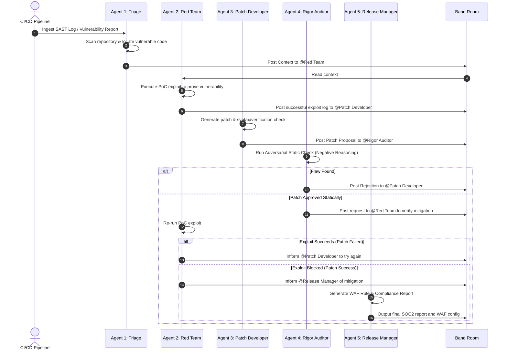

# Hackathon Plan: Ensemble AI
## Autonomous Vulnerability Triage, Adversarial Patching, and Provable Compliance Desk

Ensemble AI is a Band-coordinated multi-agent system that automates the ingestion of vulnerability reports (SAST/DAST/Bug Bounties), empirically verifies exploits, plans secure code patches, validates them, and subjects them to adversarial security review before generating production WAF rules and compliance reports.

---

## 1. Value Proposition
* **Problem**: Reviewing and patching security vulnerabilities (SQLi, XSS, RCE, broken access controls) is time-consuming for security teams and developers. Often, patches fail to address the root cause, leaving production vulnerable.
* **Solution**: A 5-agent DevSecOps swarm that automatically verifies exploits, fixes code issues, and rigorously verifies the mitigation using adversarial logic and empirical testing.
* **Entrepreneurial Angle**: An automated compliance gate that can be integrated directly into CI/CD pipelines (GitHub Actions, GitLab CI), reducing Mean Time to Remediate (MTTR) from days to minutes while providing virtual patches (WAF rules) and signed SOC2 compliance reports.

---

## 2. Multi-Agent Architecture & Band Collaboration

Collaboration between the **five specialized agents** is central to the workflow and occurs entirely through a shared Band Room.

### Specialized Agent Specifications

#### Agent 1: Triage Agent (The Mapper)
* **Goal**: Isolate root causes from security reports, maps incoming endpoints, and scopes the context.
* **Tech**: Fast JSON/YAML parser; Large Context Window LLM. Tools: `search_code`, `read_file`.

#### Agent 2: Red Team / Exploit Engineer (The Attacker)
* **Goal**: Proves the vulnerability exists *before* patching, and proves it is mitigated *after* patching.
* **Tech**: Offensive logic LLM. Tools: `write_and_run_exploit`.

#### Agent 3: Patch Developer (The Architect)
* **Goal**: Write minimal, clean, robust fixes with associated syntax checks.
* **Tech**: Specialized Code Generation LLM (e.g., Gemini 2.5 Flash / Pro). Tools: `replace_lines`, `run_syntax_check`.

#### Agent 4: Rigor Auditor (The Falsifier)
* **Goal**: Crucial quality/compliance gatekeeper. Tries to find logic flaws in the patch using negative reasoning.
* **Tech**: High-reasoning LLM (e.g., Gemini 2.5 Flash / Pro). Tools: `read_file`, `run_sast_scan`.

#### Agent 5: Release & Compliance Manager (The Deployer)
* **Goal**: Handles business logic, infrastructure integration, and audit reporting.
* **Tech**: Policy/Compliance reasoning LLM. Tools: `generate_waf_rule`, `generate_compliance_report`.

---

## 3. Tech Stack & Partner Integrations

* **Coordination Layer**: **Band SDK / API** using real-time WebSockets to coordinate agent rooms.
* **Fast Inference**: **Google Gemini API** for rapid parsing/mapping and reasoning.
* **Visualization**: **FastAPI + React** C2 dashboard for real-time visualization of the DevSecOps pipeline, WAF rules, and target app state.

---

## 4. Entrepreneurial & GTM Opportunity
Ensemble AI is designed to scale as a commercial DevSecOps product:
1. **GitHub App Store Integration**: Sold as a SaaS billing model per repository per month.
2. **Provable Compliance Ledger**: Serves as a cryptographically signed "proof of compliance" for SOC2, ISO 27001, and HIPAA audits.
3. **WAF Synchronization**: Automatically exports custom WAF rules (ModSecurity/Cloudflare rulesets) corresponding to the patch block, ensuring virtual patching is active while the codebase patch is in staging.

---

## 5. Hackathon Execution Roadmap (June 12–19)

| Milestone / Day | Deliverable |
| :--- | :--- |
| **Day 1–2 (June 12–13)** | Set up project architecture, install dependencies, and create target mock app. |
| **Day 3–4 (June 14–15)** | Write Band adapters/connections. Verify WebSocket message flows. |
| **Day 5 (June 16)** | Implement 5-agent logic and robust tools (line-based patching, dynamic exploit runner, WAF generator). |
| **Day 6 (June 17)** | End-to-end integration tests in the modular `ensemble_ai` backend. |
| **Day 7 (June 18)** | Build React visualization dashboard (`app.py`) showing pipeline state and logs. |
| **Day 8 (June 19)** | Compile presentation slides, record the pitch video, and submit to lablab.ai. |
